# Elite Muslim

**A comprehensive Islamic companion app for Ramadan and daily spiritual practices.**

> **📢 IMPORTANT NOTICE**
>
> This repository is for **SHOWCASE PURPOSES ONLY** and contains the initial UI implementation of the Elite Muslim app. This is **NOT the actual production repository** of the full-featured app.
>
> **🔗 Try the App:**
>
> - **Google Play Store**: Download the app from [Google Play Store](https://play.google.com/store/apps/details?id=com.elitesoft23.elitemuslim&hl=en)
> - **Download**: Get the app from GitHub releases
>
> This showcase repository demonstrates the UI design and basic structure, while the production app includes complete functionality, backend integration, and regular updates.

---

Elite Muslim is a feature-rich mobile application built with Flutter and Firebase, designed to enhance your spiritual journey during Ramadan and throughout the year. The app provides essential Islamic[...] 

## ✨ Core Features

### 🕌 Islamic Essentials

- **Prayer Time Tracking** - Accurate daily prayer times with location-based calculations
- **Qibla Finder** - Compass-based Qibla direction with GPS accuracy
- **Mosque Locator** - Find nearby mosques using geolocation services
- **Hijri Calendar** - Complete Islamic calendar with important dates and events

### 📖 Spiritual Content

- **Holy Quran** - Full Quran text with audio recitations and translations
- **Hadith Collection** - Curated authentic hadiths for daily inspiration
- **Educational Videos** - Islamic knowledge and Ramadan guidance
- **Recipe Library** - Traditional Ramadan and Islamic recipes

### 📊 Progress Tracking

- **Prayer Reports** - Visual analytics of your prayer completion
- **Task Management** - Custom spiritual tasks and reminders
- **Tasbeeh Counter** - Digital dhikr counter with goal tracking
- **Progress Analytics** - Detailed insights into your spiritual journey

### 🎨 Personalization

- **Theme Customization** - Multiple Islamic themes and color schemes
- **Wallpaper Gallery** - Beautiful Islamic wallpapers and backgrounds
- **Notification Settings** - Customizable prayer and task reminders
- **Multi-language Support** - Available in multiple languages

### 🔧 Technical Features

- **Firebase Integration** - Secure cloud authentication and data sync
- **Offline Support** - Core features work without internet connection
- **Cross-platform** - Optimized for both Android and iOS devices
- **Performance Optimized** - Fast loading with minimal resource usage

## 📱 Screenshots

### Main Features

| Home Screen | Prayer Times | Quran Reader | Progress Reports |
|-------------|--------------|--------------|------------------|
| 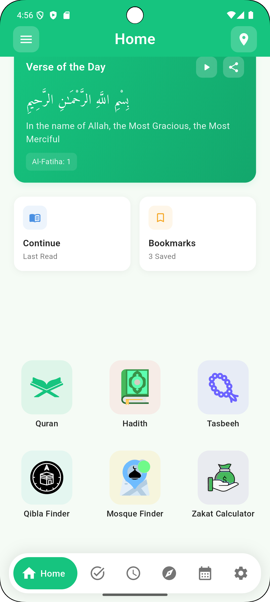 |  | 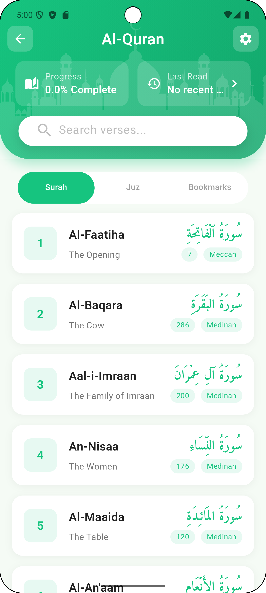 | 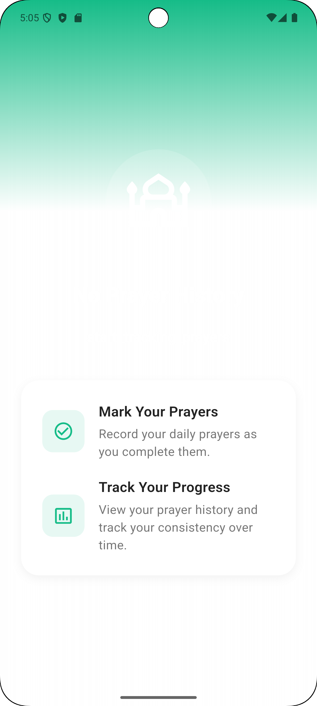 |

### Islamic Tools

| Qibla Finder | Mosque Locator | Tasbeeh Counter | Hijri Calendar |
|--------------|----------------|-----------------|----------------|
|  |  | 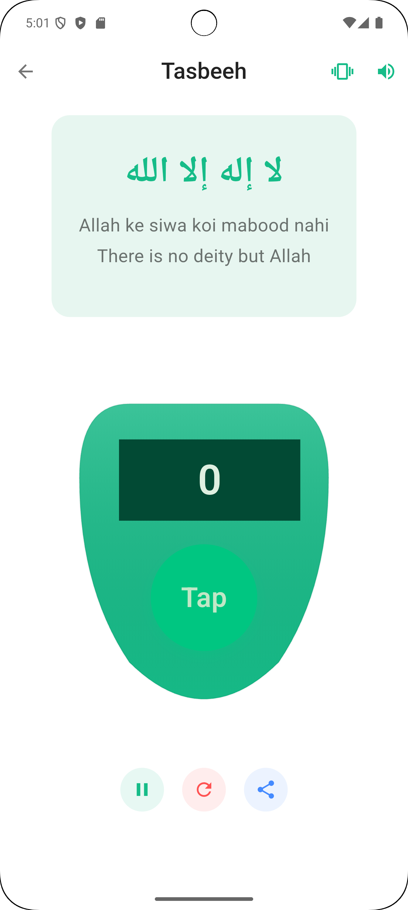 | 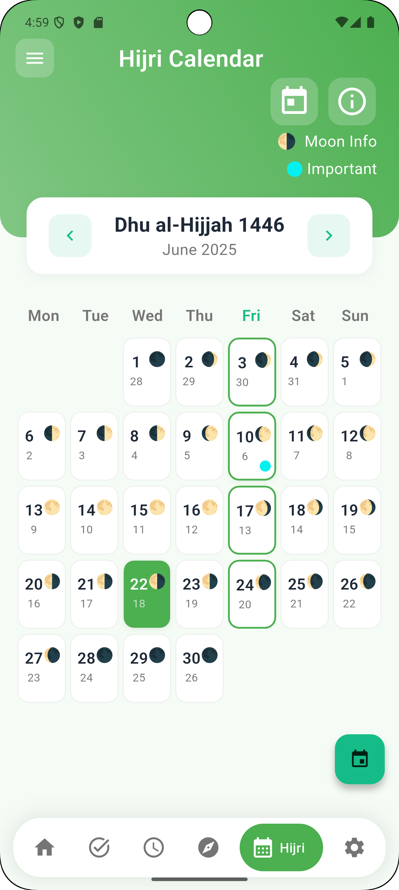 |

### Content & Customization

| Hadith Collection | Recipe Library | Wallpapers | Settings |
|-------------------|----------------|------------|----------|
| 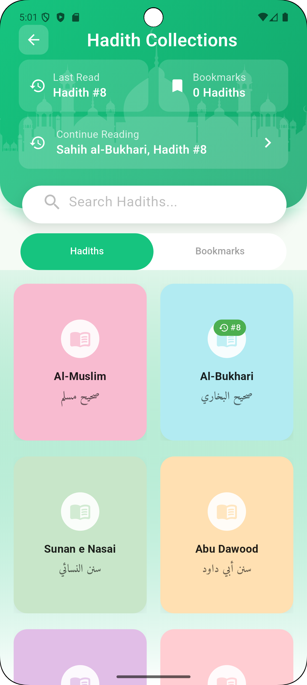 | 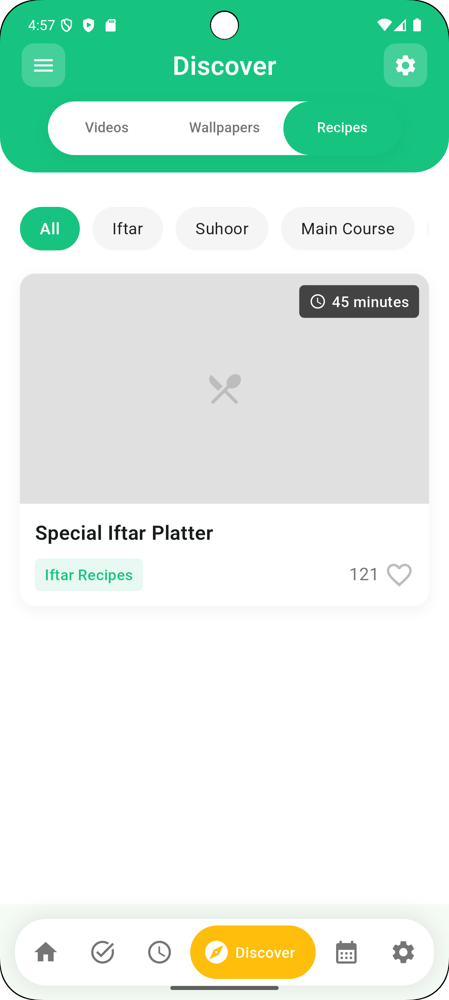 | 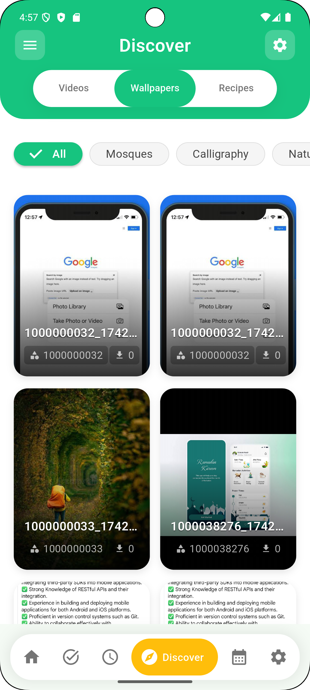 | 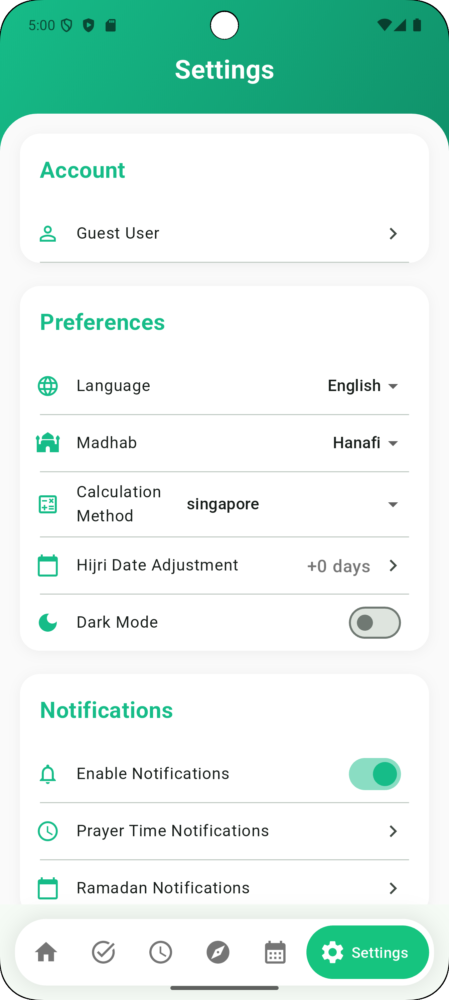 |

### Additional Features

| Prayer & Task Reports | Zakat Calculator | Video Library | CMS Admin |
|----------------------|------------------|---------------|-----------|
|  | 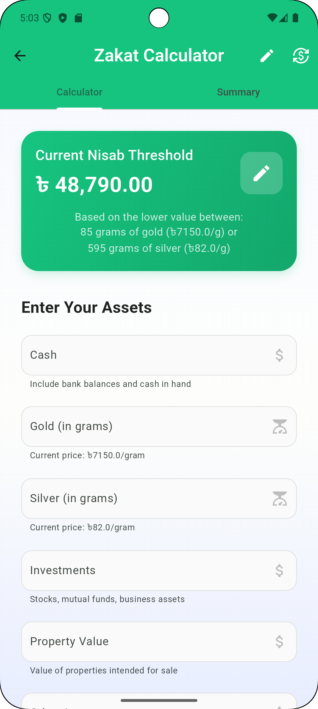 |  | 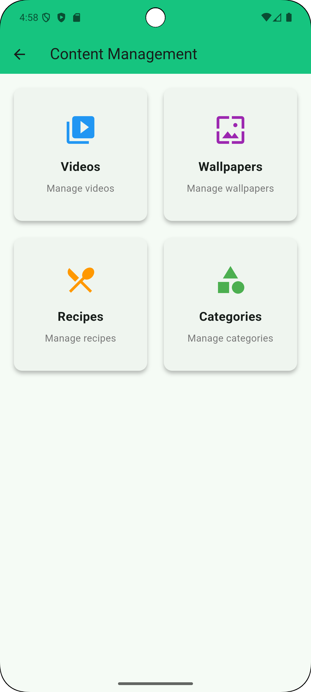 |

*View all screenshots in the [`screenshot/`](screenshot/) directory.*

## 🏗️ Project Architecture

```text
ramdan-tracker-plus/
├── lib/                          # 📱 Main application code
│   ├── screens/                  # 🖥️ UI screens and pages
│   ├── widgets/                  # 🧩 Reusable UI components
│   ├── providers/                # 🔄 State management (Riverpod)
│   ├── services/                 # 🔧 Business logic services
│   ├── models/                   # 📋 Data models and entities
│   ├── repositories/             # 💾 Data access layer
│   ├── utils/                    # 🛠️ Helper utilities
│   ├── theme/                    # 🎨 App themes and styling
│   └── config/                   # ⚙️ App configuration
├── assets/                       # 📁 Static assets
│   ├── fonts/                    # 🔤 Custom fonts
│   ├── icons/                    # 🔸 App icons
│   ├── images/                   # 🖼️ Image resources
│   └── sounds/                   # 🔊 Audio files
├── data/                         # 📊 Static data files
├── android/ & ios/               # 📱 Platform-specific code
├── screenshot/                   # 📸 App screenshots
└── my_local_package/             # 📦 Custom local packages
```

## Getting Started

1. **Clone the repository:**

   ```bash
   git clone <repo-url>
   cd ramdan_tracker
   ```

2. **Install dependencies:**

   ```bash
   flutter pub get
   ```

3. **Configure Firebase:**
   - Set up a Firebase project at [Firebase Console](https://console.firebase.google.com/).
   - Download `google-services.json` (Android) and `GoogleService-Info.plist` (iOS) and place them in the respective platform folders.
   - Update `lib/firebase_options.dart` as needed.
4. **Run the app:**

   ```bash
   flutter run
   ```

## Build & Release

- **Android:**

  ```bash
  flutter build apk
  ```

- **iOS:**

  ```bash
  flutter build ios
  ```

## Contribution Guidelines

We welcome contributions! Please follow these steps:

- Fork the repository and create your branch from `main`.
- Ensure code follows the existing style and best practices.
- Write clear commit messages.
- Add tests for new features.
- Open a pull request with a detailed description of your changes.

## Issues & Support

If you encounter any issues or have feature requests, please open an issue in the repository.

## License

This project is licensed under the MIT License. See the [LICENSE](LICENSE) file for details.

## Acknowledgements

- [Flutter](https://flutter.dev/)
- [Firebase](https://firebase.google.com/)
- [Quran.com API](https://quran.api-docs.io/)
- [Open Source Contributors](https://github.com/)

